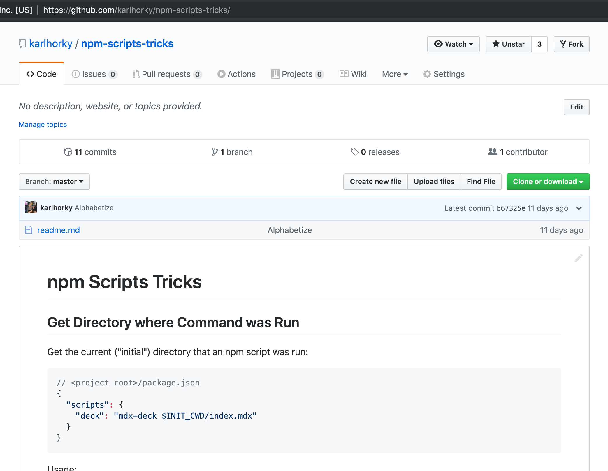

# GitHub Tricks

A collection of useful GitHub tricks

## GitHub Actions: Edit `.json`, `.yml` and `.csv` Files Without Installing Anything

`yq` (similar to `jq`) is preinstalled on GitHub Actions runners, which means you can edit a `.json`, `.yml` or `.csv` file very easily without installing any software.

For example, the following workflow file would use `yq` to copy all `"resolutions"` to `"overrides"` in a `package.json` file (and then commit the result using `stefanzweifel/git-auto-commit-action`.

**`.github/workflows/copy-resolutions-to-overrides.yml`**

```yml
name: Copy Yarn Resolutions to npm Overrides

on:
  push:
    branches:
      # Match every branch except for main
      - '**'
      - '!main'

jobs:
  build:
    name: Copy Yarn Resolutions to npm Overrides
    runs-on: ubuntu-latest
    steps:
      - uses: actions/checkout@v3
        # To trigger further `on: [push]` workflow runs
        # Ref: https://github.com/peter-evans/create-pull-request/blob/main/docs/concepts-guidelines.md#triggering-further-workflow-runs
        # Ref: https://github.com/peter-evans/create-pull-request/blob/main/docs/concepts-guidelines.md#push-using-ssh-deploy-keys
        with:
          ssh-key: ${{ secrets.SSH_PRIVATE_KEY }}

      - name: Use Node.js
        uses: actions/setup-node@v3
        with:
          node-version: '16'

      - name: Copy "resolutions" object to "overrides" in package.json
        run: yq --inplace --output-format=json '.overrides = .resolutions' package.json

      - name: Install any updated dependencies
        run: npm install

      - uses: stefanzweifel/git-auto-commit-action@v4
        with:
          commit_message: Update Overrides from Resolutions
```

Or, to copy all `@types/*` and `typescript` packages from `devDependencies` to `dependencies` (eg. for a production build):

```bash
yq --inplace --output-format=json '.dependencies = .dependencies * (.devDependencies | to_entries | map(select(.key | test("^(typescript|@types/*)"))) | from_entries)' package.json
```

## GitHub Flavored Markdown Formatted Table Width

Use `&nbsp;` entities to give a table column a width:

```markdown
| property&nbsp;&nbsp;&nbsp;&nbsp;&nbsp;&nbsp;&nbsp;&nbsp;&nbsp;&nbsp;&nbsp;&nbsp;&nbsp;&nbsp;&nbsp;&nbsp;&nbsp;&nbsp;&nbsp;&nbsp;&nbsp;&nbsp;&nbsp;&nbsp;&nbsp;&nbsp;&nbsp;&nbsp;&nbsp;&nbsp;&nbsp;&nbsp;&nbsp;&nbsp;&nbsp;&nbsp;&nbsp;&nbsp;&nbsp;&nbsp;&nbsp;&nbsp;&nbsp;&nbsp;&nbsp;&nbsp;&nbsp;&nbsp;&nbsp;&nbsp;&nbsp;&nbsp;&nbsp;&nbsp;&nbsp;&nbsp;&nbsp;&nbsp;&nbsp; | description |
| --------------------------------------- | ------------------------------------- |
| `border-bottom-right-radius`            | Defines the shape of the bottom-right |
```

Demo:

| property&nbsp;&nbsp;&nbsp;&nbsp;&nbsp;&nbsp;&nbsp;&nbsp;&nbsp;&nbsp;&nbsp;&nbsp;&nbsp;&nbsp;&nbsp;&nbsp;&nbsp;&nbsp;&nbsp;&nbsp;&nbsp;&nbsp;&nbsp;&nbsp;&nbsp;&nbsp;&nbsp;&nbsp;&nbsp;&nbsp;&nbsp;&nbsp;&nbsp;&nbsp;&nbsp;&nbsp;&nbsp;&nbsp;&nbsp;&nbsp;&nbsp;&nbsp;&nbsp;&nbsp;&nbsp;&nbsp;&nbsp;&nbsp;&nbsp;&nbsp;&nbsp;&nbsp;&nbsp;&nbsp;&nbsp;&nbsp;&nbsp;&nbsp;&nbsp; | description                           |
| --------------------------------------- | ------------------------------------- |
| `border-bottom-right-radius`            | Defines the shape of the bottom-right |

## GitHub Flavored Markdown Linking to Anchors in Other Markdown Files

Linking to an anchor in a relative Markdown file path in the same repo (eg. `./windows.md#user-content-xxx`) doesn't currently work on GitHub (Mar 2023). Probably another bug in GitHub's client-side router, maybe fixed sometime.

A workaround is to link to the full GitHub URL with a `www.` subdomain - this will cause a redirect to the non-`www.` version, and scroll to the anchor:

```diff
-[Expo + React Native](./windows.md#user-content-expo-react-native)
+[Expo + React Native](https://www.github.com/upleveled/system-setup/blob/main/windows.md#user-content-expo-react-native)
```

## README Symlinks

When in a particular folder (such as the root directory), GitHub displays content from README files underneath the files in that folder:



However, these README files need to be named `README.md`, `readme.md`, `README.mdx` or `readme.mdx` in order to be recognized. GitHub doesn't display the content of certain common Markdown index filenames such as `index.md` or `index.mdx` ([❓MDX file extension](https://github.com/mdx-js/mdx)) ([as of 18 June 2019](https://twitter.com/karlhorky/status/1140962752858677249)).

GitHub does however follow symlinks named `README.md`, `readme.md`, `README.mdx` and `readme.mdx`. See example here: [mdx-deck root folder](https://github.com/jxnblk/mdx-deck), [mdx-deck symlink README.md](https://github.com/jxnblk/mdx-deck/blob/master/README.md)

So if you want to use another file (also in a subdirectory) as the contents displayed within a directory, create a symlink pointing at it:

```sh
ln -s index.md README.md
```

### Shell Script: Create README Symlinks

If you have many directories with `index.mdx` files that you want to display as the readme content when you enter those directories on the web version of GitHub, you can run this script in the containing directory.

```sh
# Create symlinks for all directories within the current directory that
# do not yet have README.mdx files.
find . -mindepth 1 -maxdepth 1 -type d '!' -exec test -e "{}/README.mdx" ';' -print0 | while IFS= read -r -d $'\0' line; do
    cd $line && ln -s index.mdx README.mdx && cd ..
done
```
