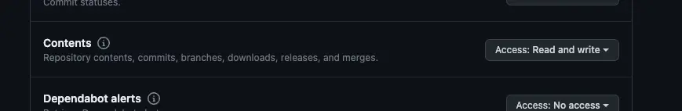
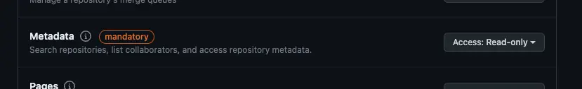
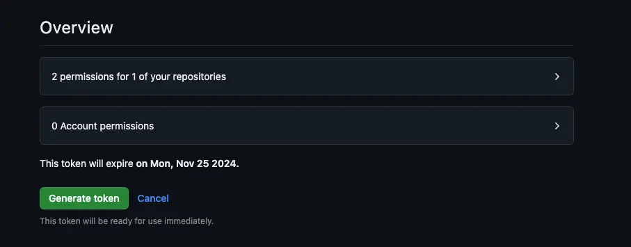
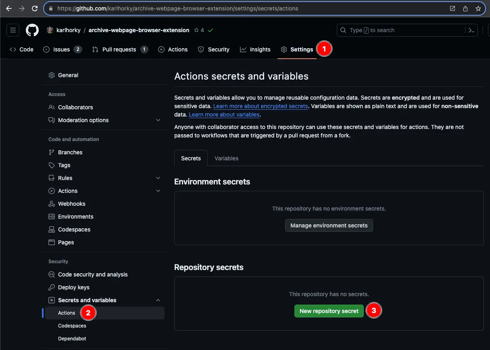
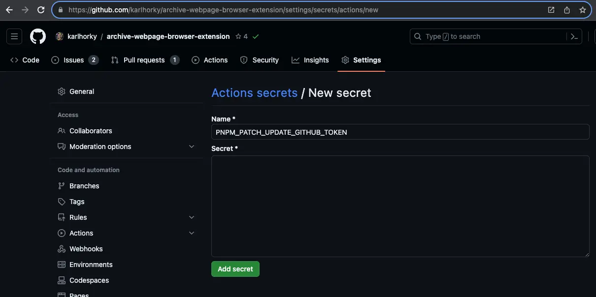
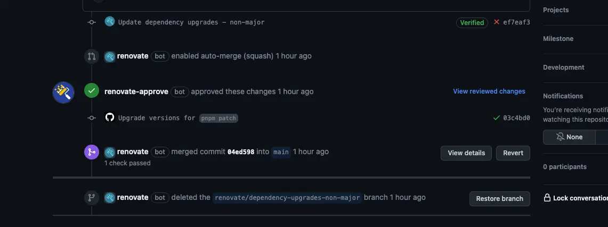
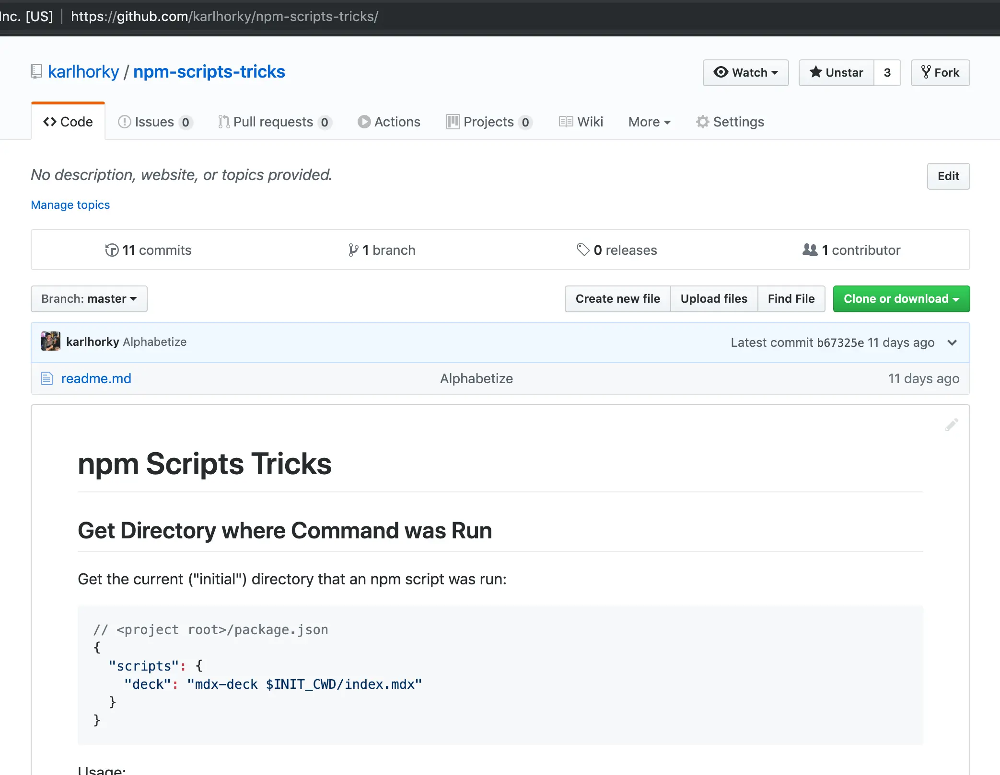

# GitHub Tricks

A collection of useful GitHub tricks

## GitHub Actions: Edit `.json`, `.yml` and `.csv` Files Without Installing Anything

`yq` (similar to `jq`) is preinstalled on GitHub Actions runners, which means you can edit a `.json`, `.yml` or `.csv` file very easily without installing any software.

For example, the following workflow file would use `yq` to copy all `"resolutions"` to `"overrides"` in a `package.json` file (and then commit the result using `stefanzweifel/git-auto-commit-action`.

**`.github/workflows/copy-resolutions-to-overrides.yml`**

```yml
name: Copy Yarn Resolutions to npm Overrides

on:
  push:
    branches:
      # Match every branch except for main
      - '**'
      - '!main'

jobs:
  build:
    name: Copy Yarn Resolutions to npm Overrides
    runs-on: ubuntu-latest
    steps:
      - uses: actions/checkout@v3
        # To trigger further `on: [push]` workflow runs
        # Ref: https://github.com/peter-evans/create-pull-request/blob/main/docs/concepts-guidelines.md#triggering-further-workflow-runs
        # Ref: https://github.com/peter-evans/create-pull-request/blob/main/docs/concepts-guidelines.md#push-using-ssh-deploy-keys
        with:
          ssh-key: ${{ secrets.SSH_PRIVATE_KEY }}

      - name: Use Node.js
        uses: actions/setup-node@v3
        with:
          node-version: '16'

      - name: Copy "resolutions" object to "overrides" in package.json
        run: yq --inplace --output-format=json '.overrides = .resolutions' package.json

      - name: Install any updated dependencies
        run: npm install

      - uses: stefanzweifel/git-auto-commit-action@v4
        with:
          commit_message: Update Overrides from Resolutions
```

Or, to copy all `@types/*` and `typescript` packages from `devDependencies` to `dependencies` (eg. for a production build):

```bash
yq --inplace --output-format=json '.dependencies = .dependencies * (.devDependencies | to_entries | map(select(.key | test("^(typescript|@types/*)"))) | from_entries)' package.json
```

## GitHub Actions: Push to Pull Request and Re-Run Workflows

It can be useful to commit and push to a pull request in a GitHub Actions workflow, eg. an automated script that fixes something like [upgrading pnpm patch versions on automatic Renovate dependency upgrades](https://github.com/pnpm/pnpm/issues/5686#issuecomment-1669538653).

Once your script makes the commit and pushes to the PR, it can also be useful to re-run the workflows on that commit, eg. linting the new commit, so that [GitHub auto-merge](https://docs.github.com/en/pull-requests/collaborating-with-pull-requests/incorporating-changes-from-a-pull-request/automatically-merging-a-pull-request) can run also on [protected branches with required status checks](https://docs.github.com/en/repositories/configuring-branches-and-merges-in-your-repository/managing-protected-branches/about-protected-branches#require-status-checks-before-merging).

‼️ WARNING: Make sure that you do not create a loop! Once your script creates a commit, the workflow will run your script again on the new commit. On the 2nd run, it **should not** create a new commit, or you will have an endless loop of GitHub Actions workflow runs. 😬 We will revisit this in the script below.

1. First, create a GitHub fine-grained personal access token:
   1. Visit https://github.com/settings/personal-access-tokens/new
   2. Fill out **Token name** (repository name + a short reminder), **Expiration** (longest available, 1 year), **Description** (a reminder of the purpose)<br /><br />
      <br /><br />
   3. Under **Repository access**, choose **Only select repositories** and then choose the repository where the workflow will run<br /><br />
      <br /><br />
   4. Under **Permissions**, expand **Repository permissions**, locate **Contents** and choose **Access: Read and write**<br /><br />
      <br /><br />
      This will also by default set **Metadata** to **Access: Read-only**<br /><br />
      <br /><br />
   5. Review your settings under **Overview** - it should be set to "2 permissions for 1 of your repositories" and "0 Account permissions"<br /><br />
      <br /><br />
   6. If you are satisfied with this, click on **Generate token**.
   7. This will show you the token on your screen only once, so be careful to copy the token.
2. Add a repository secret
   1. In the repository where the workflow will run, visit **Settings** -> **Secrets and variables** -> **Actions** and click on **New repository secret**<br /><br />
      <br /><br />
   2. For **Name**, enter a `SCREAMING_SNAKE_CASE` name that makes it clear that it's a GitHub token (eg. `PNPM_PATCH_UPDATE_GITHUB_TOKEN`) and for **Secret** paste in the token that you copied at the end of step 1 above<br /><br />
      <br /><br />
3. Adjust your workflow for the token

   1. Under `uses: actions/checkout`, add a `with:` block including `persist-credentials: false`
      ```yaml
      - uses: actions/checkout@v4
        with:
          # Disable configuring $GITHUB_TOKEN in local git config
          persist-credentials: false
      ```
   2. ‼️ IMPORTANT: As mentioned above, make sure that you don't create a loop! Make sure that your script which alters files includes some kind of way to exit early, for example checking `git status --porcelain` and running `exit 0` to exit the script early without errors or [by skipping steps based on the last commits](https://joht.github.io/johtizen/build/2022/01/20/github-actions-push-into-repository.html#skip-push-on-auto-commit)

      ```yaml
      - name: Fix `pnpm patch` not upgrading patch versions automatically
        run: |
          # <your script makes changes here>

          git add package.json pnpm-lock.yaml patches
          if [ -z "$(git status --porcelain)" ]; then
            echo "No changes to commit, exiting"
            exit 0
          fi

          # <your script sets Git credentials and commits here>
          # <your script pushes here>
      ```

   3. Set your Git `user.email` and `user.name` credentials to the GitHub Actions bot and commit:

      ```yaml
      - name: Fix `pnpm patch` not upgrading patch versions automatically
        run: |
          # <your script makes changes here>
          # <your script exits early here>

          git config user.email github-actions[bot]@users.noreply.github.com
          git config user.name github-actions[bot]

          git commit -m "Upgrade versions for \`pnpm patch\`"

          # <your script pushes here>
      ```

   4. Use the token via `secrets.<name>` in your Git origin in your workflow (credit: [`ad-m/github-push-action`](https://github.com/ad-m/github-push-action/blob/d91a481090679876dfc4178fef17f286781251df/start.sh#L43-L55))

      ```yaml
      - name: Fix `pnpm patch` not upgrading patch versions automatically
        run: |
          # <your script makes changes here>
          # <your script exits early here>
          # <your script sets Git credentials and commits here>

          # Credit for oauth2 syntax is the ad-m/github-push-action GitHub Action:
          # https://github.com/ad-m/github-push-action/blob/d91a481090679876dfc4178fef17f286781251df/start.sh#L43-L5
          git push https://oauth2:${{ secrets.PNPM_PATCH_UPDATE_GITHUB_TOKEN }}@github.com/${{ github.repository }}.git HEAD:${{ github.ref }}
      ```

### Example

[`.github/workflows/lint-check-types-and-build.yml`](https://github.com/karlhorky/archive-webpage-browser-extension/blob/main/.github/workflows/lint-check-types-and-build.yml)

```yaml
name: Lint, Check Types, Build
on: push

jobs:
  lint-check-types-and-build:
    name: Lint, Check Types, Build
    runs-on: ubuntu-latest
    steps:
      - uses: actions/checkout@v4
        with:
          # Disable configuring $GITHUB_TOKEN in local git config
          persist-credentials: false
      - uses: pnpm/action-setup@v2
        with:
          version: 'latest'
      - uses: actions/setup-node@v4
        with:
          node-version: 'lts/*'
          cache: 'pnpm'

      # Fix `pnpm patch` not upgrading patch versions automatically
      # https://github.com/pnpm/pnpm/issues/5686#issuecomment-1527221879
      - name: Fix `pnpm patch` not upgrading patch versions automatically
        run: |
          ./scripts/fix-pnpm-patches.sh

          git add package.json pnpm-lock.yaml patches
          if [ -z "$(git status --porcelain)" ]; then
            echo "No changes to commit, exiting"
            exit 0
          fi

          git config user.email github-actions[bot]@users.noreply.github.com
          git config user.name github-actions[bot]

          git commit -m "Upgrade versions for \`pnpm patch\`"

          # Credit for oauth2 syntax is the ad-m/github-push-action GitHub Action:
          # https://github.com/ad-m/github-push-action/blob/d91a481090679876dfc4178fef17f286781251df/start.sh#L43-L55
          git push https://oauth2:${{ secrets.PNPM_PATCH_UPDATE_GITHUB_TOKEN }}@github.com/${{ github.repository }}.git HEAD:${{ github.ref }}

      - name: Install dependencies
        run: pnpm install
      - run: pnpm eslint . --max-warnings 0
      - run: pnpm tsc
      - name: Build extension
        run: pnpm build
```

Pull request with automatic PR commit including workflow checks: https://github.com/karlhorky/archive-webpage-browser-extension/pull/47

<figure>
  
  <figcaption>
    <em>
      Screenshot of a GitHub PR showing two commits, the first by Renovate bot upgrading dependencies and the second by the automated script shown above. Both commits have green checkmarks next to them, indicating that the workflows have run on them, making the PR auto-merge succeed at the very bottom.
    </em>
  </figcaption>
  <br />
  <br />
</figure>

## GitHub Flavored Markdown Formatted Table Width

Use `&nbsp;` entities to give a table column a width:

```markdown
| property&nbsp;&nbsp;&nbsp;&nbsp;&nbsp;&nbsp;&nbsp;&nbsp;&nbsp;&nbsp;&nbsp;&nbsp;&nbsp;&nbsp;&nbsp;&nbsp;&nbsp;&nbsp;&nbsp;&nbsp;&nbsp;&nbsp;&nbsp;&nbsp;&nbsp;&nbsp;&nbsp;&nbsp;&nbsp;&nbsp;&nbsp;&nbsp;&nbsp;&nbsp;&nbsp;&nbsp;&nbsp;&nbsp;&nbsp;&nbsp;&nbsp;&nbsp;&nbsp;&nbsp;&nbsp;&nbsp;&nbsp;&nbsp;&nbsp;&nbsp;&nbsp;&nbsp;&nbsp;&nbsp;&nbsp;&nbsp;&nbsp;&nbsp;&nbsp; | description                           |
| -------------------------------------------------------------------------------------------------------------------------------------------------------------------------------------------------------------------------------------------------------------------------------------------------------------------------------------------------------------------------- | ------------------------------------- |
| `border-bottom-right-radius`                                                                                                                                                                                                                                                                                                                                               | Defines the shape of the bottom-right |
```

Demo:

| property&nbsp;&nbsp;&nbsp;&nbsp;&nbsp;&nbsp;&nbsp;&nbsp;&nbsp;&nbsp;&nbsp;&nbsp;&nbsp;&nbsp;&nbsp;&nbsp;&nbsp;&nbsp;&nbsp;&nbsp;&nbsp;&nbsp;&nbsp;&nbsp;&nbsp;&nbsp;&nbsp;&nbsp;&nbsp;&nbsp;&nbsp;&nbsp;&nbsp;&nbsp;&nbsp;&nbsp;&nbsp;&nbsp;&nbsp;&nbsp;&nbsp;&nbsp;&nbsp;&nbsp;&nbsp;&nbsp;&nbsp;&nbsp;&nbsp;&nbsp;&nbsp;&nbsp;&nbsp;&nbsp;&nbsp;&nbsp;&nbsp;&nbsp;&nbsp; | description                           |
| -------------------------------------------------------------------------------------------------------------------------------------------------------------------------------------------------------------------------------------------------------------------------------------------------------------------------------------------------------------------------- | ------------------------------------- |
| `border-bottom-right-radius`                                                                                                                                                                                                                                                                                                                                               | Defines the shape of the bottom-right |

## GitHub Flavored Markdown Linking to Anchors in Other Markdown Files

Linking to an anchor in a relative Markdown file path in the same repo (eg. `./windows.md#user-content-xxx`) doesn't currently work on GitHub (Mar 2023). Probably another bug in GitHub's client-side router, maybe fixed sometime.

A workaround is to link to the full GitHub URL with a `www.` subdomain - this will cause a redirect to the non-`www.` version, and scroll to the anchor:

```diff
-[Expo + React Native](./windows.md#user-content-expo-react-native)
+[Expo + React Native](https://www.github.com/upleveled/system-setup/blob/main/windows.md#user-content-expo-react-native)
```

## README Symlinks

When in a particular folder (such as the root directory), GitHub displays content from README files underneath the files in that folder:



However, these README files need to be named `README.md`, `readme.md`, `README.mdx` or `readme.mdx` in order to be recognized. GitHub doesn't display the content of certain common Markdown index filenames such as `index.md` or `index.mdx` ([❓MDX file extension](https://github.com/mdx-js/mdx)) ([as of 18 June 2019](https://twitter.com/karlhorky/status/1140962752858677249)).

GitHub does however follow symlinks named `README.md`, `readme.md`, `README.mdx` and `readme.mdx`. See example here: [mdx-deck root folder](https://github.com/jxnblk/mdx-deck), [mdx-deck symlink README.md](https://github.com/jxnblk/mdx-deck/blob/master/README.md)

So if you want to use another file (also in a subdirectory) as the contents displayed within a directory, create a symlink pointing at it:

```sh
ln -s index.md README.md
```

### Shell Script: Create README Symlinks

If you have many directories with `index.mdx` files that you want to display as the readme content when you enter those directories on the web version of GitHub, you can run this script in the containing directory.

```sh
# Create symlinks for all directories within the current directory that
# do not yet have README.mdx files.
find . -mindepth 1 -maxdepth 1 -type d '!' -exec test -e "{}/README.mdx" ';' -print0 | while IFS= read -r -d $'\0' line; do
    cd $line && ln -s index.mdx README.mdx && cd ..
done
```
